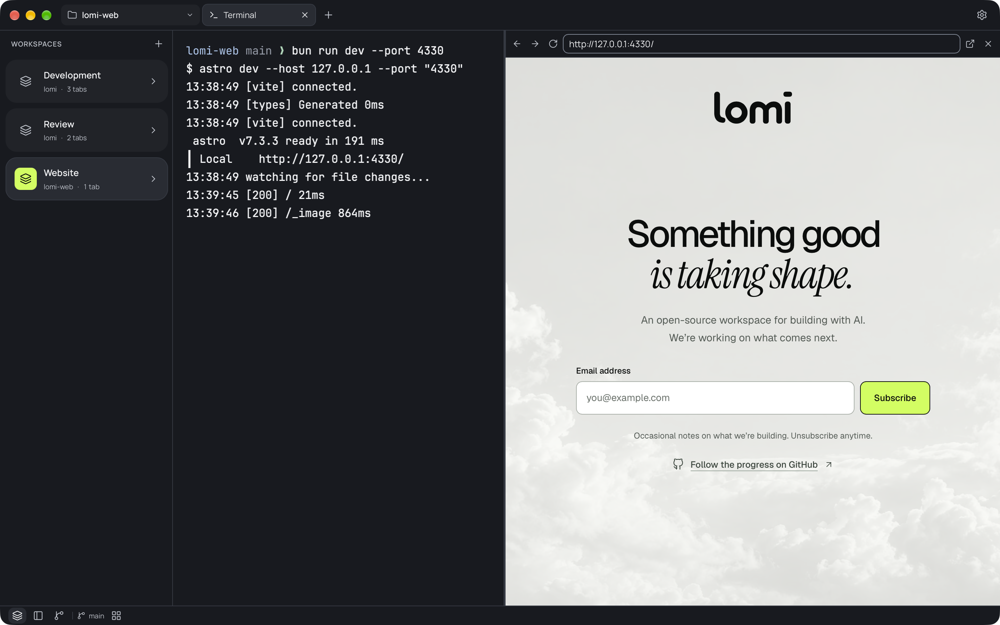
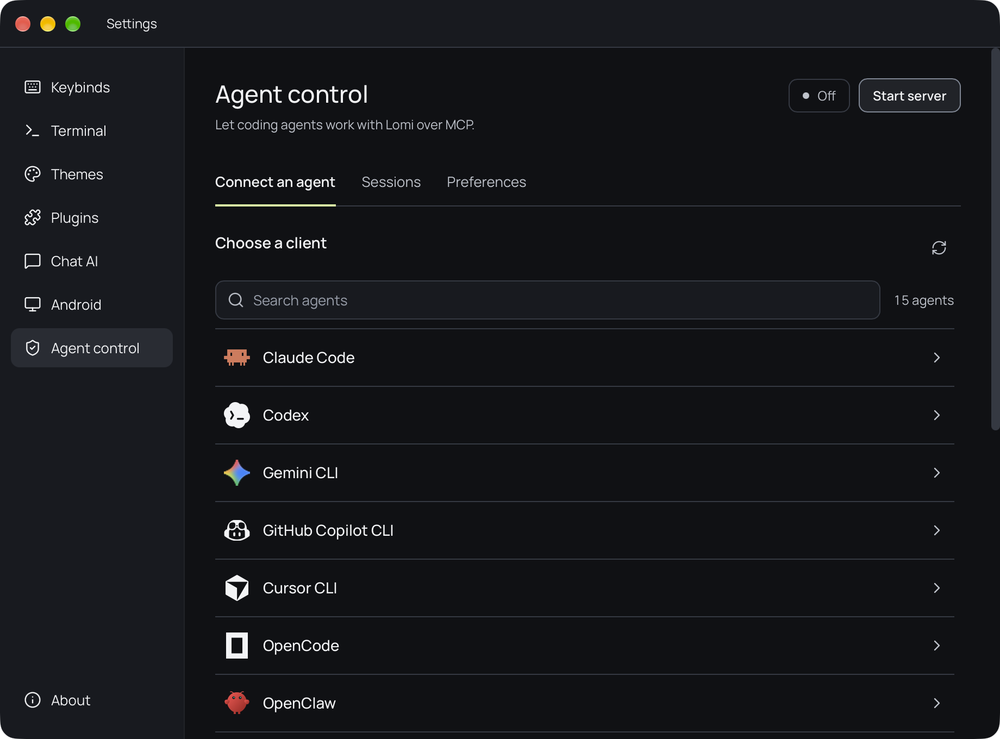
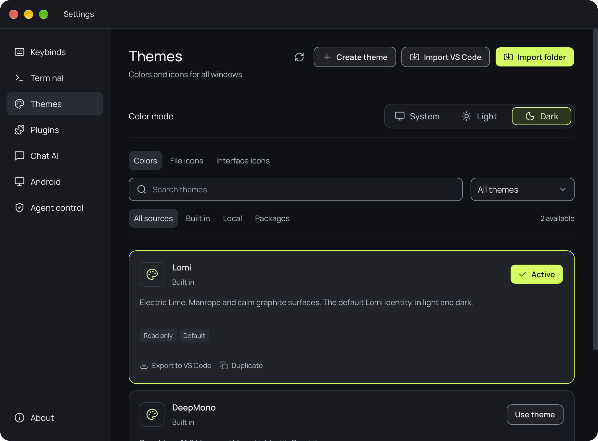

<div align="center">
  
  <h1>Lomi</h1>
  <p><strong>The open-source desktop workspace for terminal-driven development.</strong></p>
  <p>Native terminals, a code editor, browser previews, Git and your coding agents in one window.</p>
  <p>
    <a href="https://github.com/lomi-dev/lomi/releases/latest"></a>
    <a href="https://github.com/lomi-dev/lomi/releases"></a>
    
    <a href="LICENSE"></a>
  </p>
  <p>
    <a href="https://lomi.dev">Website</a> ·
    <a href="https://github.com/lomi-dev/lomi/releases/latest">Download</a> ·
    <a href="#features">Features</a> ·
    <a href="#documentation">Docs</a> ·
    <a href="#build-from-source">Build from source</a> ·
    <a href="https://github.com/lomi-dev/lomi/issues">Report an issue</a>
  </p>
</div>

<picture>
  <source media="(prefers-color-scheme: light)" srcset="docs/images/workbench-light.png" />
  
</picture>

## What is Lomi?

Lomi is a local development workspace for macOS, Linux and Windows. Open a
project folder and arrange real shells, editors, browser previews, Git views and
AI chats side by side. Keep separate workspaces for separate tasks; their
terminals keep running in the background while you switch.

Run Claude Code, Codex, Gemini CLI or any other CLI agent in a Lomi terminal,
and let it work with your workspace over MCP once you approve it. Lomi is built
with Tauri 2 and Rust and uses the system webview. There is no account and no
telemetry: API keys stay in your system credential store, and history stays on
your device.

## Screenshots

<table>
  <tr>
    <td width="50%" align="center"><br /><sub>Preview a local dev server next to the terminal that runs it</sub></td>
    <td width="50%" align="center"><br /><sub>Browse history, inspect commits and review diffs</sub></td>
  </tr>
  <tr>
    <td align="center"><br /><sub>Connect coding agents to Lomi over MCP</sub></td>
    <td align="center"><br /><sub>Built-in themes, light and dark modes, VS Code import</sub></td>
  </tr>
</table>

## Features

### Workspaces

- A project is a folder; each named workspace keeps its own tabs. Dock
  terminals, editors, browsers, chats and phones in any split layout, and place
  Workspaces, Explorer and Source Control on either side.
- Sessions restore projects, layouts and working directories with fresh shells.
  Commands are never replayed; running processes, terminal output and unsaved
  edits are not restored.

### Terminals

- Native shells through `portable-pty`, rendered by xterm.js with WebGL. Output
  keeps streaming in hidden tabs and other workspaces.
- Bash, Zsh, Fish, PowerShell and Command Prompt, plus WSL distributions on
  Windows.
- Find, multiline command input, command blocks and a terminal overview appear
  only when you ask for them.
- Dropped files become shell-quoted paths, and screenshots paste straight into
  CLI agents such as Codex.

### Code and files

- CodeMirror 6 with syntax highlighting for TypeScript, Rust, Python, Go,
  C/C++, Java, HTML, CSS, JSON, YAML, SQL, Markdown and more.
- Views of one file share edits and undo history. Unsaved work is never
  discarded silently; encodings, line endings and permissions are preserved.
- Explorer with project search and file operations, live Markdown and SVG
  previews, and image previews from PNG and WebP to TIFF and OpenEXR.

### Git

- Source Control for every repository in a project: stage, unstage, commit,
  fetch, pull and push.
- Paginated history, commit details and read-only diffs in their own tabs.
  Nothing is staged, committed or pushed without an explicit action.

### Browser and Android

- Browser panels use the system webview, suggest local dev servers and keep
  their state across tabs. Pages get a separate storage profile and no
  application privileges.
- Virtual Android phones run inside a panel, without Android Studio or an
  emulator window. Setup is currently available on macOS with Apple Silicon.

### Coding agents

- On macOS and Linux, Lomi recognizes more than 30 CLI agents in its terminals
  and offers their missing titlebar, notification and MCP integrations.
  Configuration changes only after a click and keeps a backup.
- **Agent control** lets a paired agent use Lomi's terminals, browser panels,
  files, Git, Android phones and chats through MCP, limited to the workspaces
  and permissions you approve. It currently requires macOS with Apple Silicon.

### Chat AI

- Chat with OpenAI, Anthropic, Google Gemini, xAI, OpenRouter, DeepSeek or
  NVIDIA using your own API keys. Stream, retry, branch by editing, search local
  history and export to Markdown or JSON.
- Responses cannot run commands or edit files.

### Make it yours

- Lomi and DeepMono themes in light, dark or system mode. Create JSONC themes
  with CSS and local assets, or import and export VS Code color and icon themes.
- Configurable shortcuts and optional focus-follows-pointer.
- Trusted local plugins add views, sidebars and commands. Launch with
  `lomi --safe-mode` to skip third-party plugins and themes.

## Install

Download the package for your platform from the
[latest release](https://github.com/lomi-dev/lomi/releases/latest).

| Platform                     | Package                                             |
| ---------------------------- | --------------------------------------------------- |
| macOS, Apple Silicon / Intel | `aarch64.dmg` / `x64.dmg`, signed and notarized     |
| Windows x64                  | `x64-setup.exe` or `.msi`                           |
| Linux x86_64                 | AppImage, `.deb` (Debian/Ubuntu) or `.rpm` (Fedora) |

On macOS and Windows, **Settings → About** installs signed updates after
checking for unsaved work. On Linux, update through your package manager or
download the new package. Windows installers are not Authenticode-signed yet,
so SmartScreen may ask for confirmation.

> [!NOTE]
> Lomi was previously published as SimpleBench. Releases up to v0.4.0 and the
> `simplebench-bin` AUR package still use that name; `lomi-bin` and `lomi`
> join the AUR with the first Lomi release. This README describes the `main`
> branch, and the [release notes](https://github.com/lomi-dev/lomi/releases)
> list what each version includes.

## Keyboard shortcuts

Defaults for Linux and Windows. On macOS, use **Cmd** instead of **Ctrl**,
except for the terminal overview. Change any shortcut in **Settings → Keybinds**.

| Action                           | Shortcut                        |
| -------------------------------- | ------------------------------- |
| Show commands                    | `Ctrl+Shift+P`                  |
| Split terminal right / below     | `Ctrl+D` / `Ctrl+Shift+D`       |
| Close the active panel           | `Ctrl+W`                        |
| New / close tab                  | `Ctrl+Shift+T` / `Ctrl+Shift+W` |
| Next / previous tab              | `Ctrl+PageDown` / `Ctrl+PageUp` |
| Terminal overview                | `Ctrl+Tab`                      |
| Toggle Explorer / Source Control | `Ctrl+Shift+E` / `Ctrl+Shift+G` |
| Find in file / terminal          | `Ctrl+F` / `Ctrl+Shift+F`       |
| Copy / paste in a terminal       | `Ctrl+Shift+C` / `Ctrl+Shift+V` |
| Open Settings                    | `Ctrl+,`                        |

Terminal titles are hidden by default: press **Ctrl** to reveal them, or hold it
and drag a title to move its panel.

## Documentation

| Guide                                                | Covers                                                 |
| ---------------------------------------------------- | ------------------------------------------------------ |
| [Chat AI](docs/chat-ai.md)                           | Providers, keys, history, attachments and privacy      |
| [Android phones](docs/android.md)                    | Setup, controls, device data and platform limits       |
| [Agent control](docs/mcp/USAGE.md)                   | MCP server, pairing, permissions and YOLO mode         |
| [CLI agent integrations](docs/cli-agents.md)         | Supported agents, configuration files and manual setup |
| [Terminal clipboard](docs/terminal-clipboard.md)     | Pasting images into CLI agents                         |
| [Themes](themes/README.md)                           | JSONC theme packages, assets, CSS and VS Code themes   |
| [Plugin SDK](https://github.com/lomi-dev/plugin-sdk) | Building trusted local plugins                         |
| [Releases](docs/releases.md)                         | Packaging, signing and publishing                      |

## Build from source

Install Node.js 22.14 or newer, pnpm (the version pinned in
[package.json](package.json)), stable Rust, and the
[Tauri prerequisites](https://v2.tauri.app/start/prerequisites/) for your
platform.

```sh
git clone https://github.com/lomi-dev/lomi.git
cd lomi
pnpm install --frozen-lockfile
pnpm tauri dev
```

`pnpm dev` serves only the frontend at `http://127.0.0.1:1420`. Terminals, file
access and browser panels need the desktop application.

### Validation and builds

```sh
pnpm check          # TypeScript, plugin SDK contract and AI runtime
pnpm test           # model and behavior tests
pnpm test:ui        # Playwright interface tests (install Chromium first)
pnpm format:check   # frontend and documentation formatting
cargo test   --manifest-path src-tauri/Cargo.toml --locked
cargo clippy --manifest-path src-tauri/Cargo.toml --locked -- -D warnings
cargo fmt    --manifest-path src-tauri/Cargo.toml --check
```

Install Playwright's browser with `pnpm exec playwright install chromium`, or
`webkit` for `pnpm test:ui:webkit`. Playwright mocks native commands, so changes
to PTYs, webviews and native windows also need a check in the desktop app.

Build an executable with `pnpm tauri build --no-bundle`, or platform installers
with `pnpm tauri build`.

**Stack:** Tauri 2, Rust, `portable-pty`, React 19, TypeScript, Vite, xterm.js,
CodeMirror 6, Dockview and AI SDK. [AGENTS.md](AGENTS.md) maps the source tree
and its invariants.

## Contributing

Issues and pull requests are welcome. Read [AGENTS.md](AGENTS.md) before
changing code, keep changes focused, and use
`type(scope): short imperative summary` for commit and pull request titles.
Fill in the [pull request template](.github/pull_request_template.md) with the
checks you actually ran. Do not add AI co-author attribution. Keep screenshots
aligned with the real interface; [capture notes](docs/screenshots.md) describe
how the images above were made.

## License

Copyright 2026 Maciej Kolerski. Licensed under [Apache 2.0](LICENSE).

The default Lomi theme follows the Lomi Brandbook and Design System. The
optional DeepMono palette is based on DeepMono by viewerofall. Bundled fonts,
including Manrope and JetBrains Mono, keep their own licenses in
[public/fonts](public/fonts).
