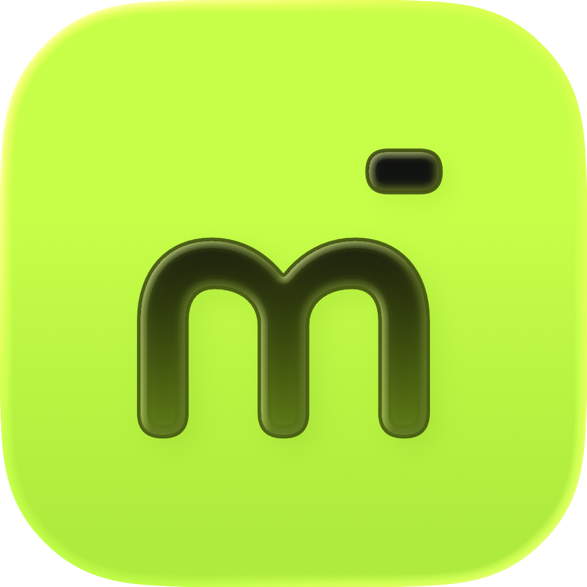
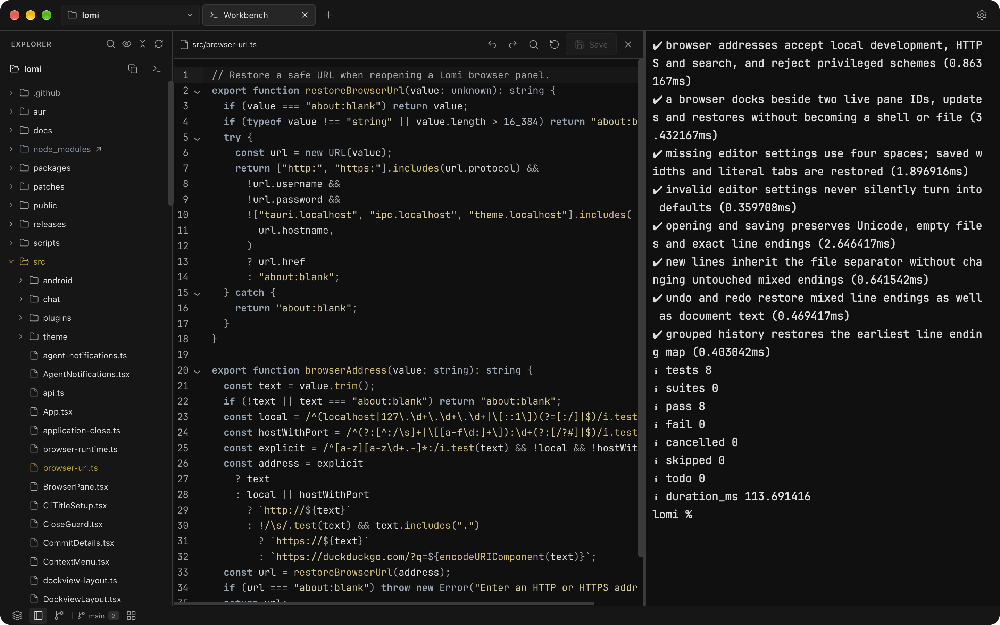
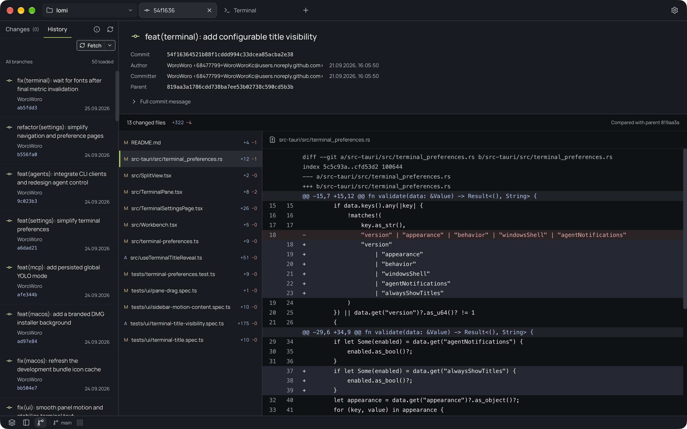
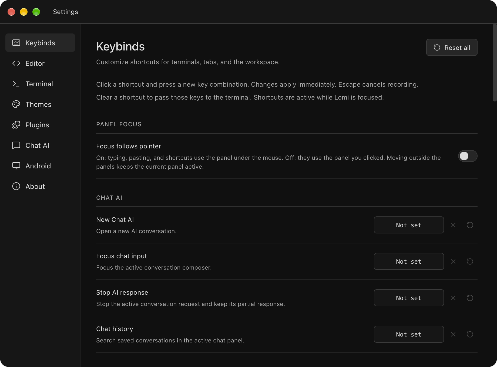

<div align="center">
  
  <h1>Lomi</h1>
  <p><strong>Your terminal, code, and browser in one desktop workspace.</strong></p>
  <p>A local development environment for Linux, macOS, and Windows.</p>
  <p>
    <a href="https://github.com/lomi-dev/lomi/releases/latest">Download</a> ·
    <a href="#work-in-one-workspace">Features</a> ·
    <a href="#keyboard-shortcuts">Shortcuts</a> ·
    <a href="#develop-from-source">Development</a> ·
    <a href="https://github.com/lomi-dev/lomi/issues">Report an issue</a>
  </p>
</div>



Open a project folder, arrange your panels, and get to work. Lomi brings
native terminals, file editing, browser previews, and Git into the same window.
Create separate workspaces for different tasks while keeping their shells running
in the background.

_Screenshots show a native Linux development build with the bundled DeepMono dark
theme. This README describes the current development branch; see the
[release notes](https://github.com/lomi-dev/lomi/releases) for the
features included in each download._

## Download and install

Choose a package from the [latest release](https://github.com/lomi-dev/lomi/releases/latest).

| Platform            | Package                                                  |
| ------------------- | -------------------------------------------------------- |
| Linux x86_64        | AppImage, `.deb` for Debian/Ubuntu, or `.rpm` for Fedora |
| macOS Apple Silicon | `aarch64.dmg`                                            |
| macOS Intel         | `x64.dmg`                                                |
| Windows x64         | `.exe` installer or `.msi`                               |

On Arch Linux, install the prebuilt [AUR package](https://aur.archlinux.org/packages/lomi-bin):

```sh
yay -S lomi-bin
```

The [lomi](https://aur.archlinux.org/packages/lomi) AUR package builds
from source. For an AppImage, enable **Allow executing file as program** in your
file manager before opening it.

Check for updates in **Settings → About**. Windows and macOS can install signed
update packages after checking open work and saving the session. Linux provides
package-manager or download instructions. See the [release guide](docs/releases.md)
for packaging and signing details.

## Work in one workspace

On first launch, choose **Open folder or repository**. Open a file from Explorer,
run a command in the terminal, or use the **+** button to add a tab. For a separate
task in the same folder, open the Workspaces sidebar and choose **New workspace**.

- **Keep your shell running.** Split terminals, switch tabs, and move between
  workspaces while background processes continue. Use installed shells, including
  Bash, Zsh, Fish, PowerShell, and Windows Command Prompt; WSL distributions appear
  as separate environments on Windows.
- **Arrange panels around the task.** Dock terminals, files, browsers, and AI chats beside
  one another. Move panels without restarting shells or losing editor buffers.
  Maximize a panel when you need more space.
- **Edit files where you work.** Browse and search the project, create and rename
  files, and edit with syntax highlighting. Views of the same file share edits
  and undo history. Markdown files include a live preview.
- **View images in the workspace.** Open PNG/APNG, JPEG/JFIF, WebP, GIF, SVG,
  AVIF, ICO, and BMP files from Explorer. Previews support fit, actual size,
  zoom, transparency, and reload from disk, including in split panels and
  restored tabs. TIFF, TGA, DDS, PNM, QOI, HDR, OpenEXR, and Farbfeld use native
  conversion for preview without changing the original file. Previews accept
  files up to 32 MiB; native conversion is limited to 16 megapixels and 128 MiB
  of decoded pixels. Converted previews show the first image in 8-bit RGBA;
  webview support determines which AVIF and animated image variants can play.
- **Preview local services.** Browser panels use the operating system's webview.
  The address bar suggests discovered local HTTP servers; pages retain their
  state when you switch tabs or workspaces.
- **Separate projects and tasks.** A project is a folder; its named workspaces
  hold separate sets of tabs. Place Workspaces, Explorer, and Source Control on
  either side of the window.

### Connect a local MCP client

Source builds on macOS Apple Silicon include **Settings → Agent control**.
Pair a local MCP client and grant access to selected workspaces, tools and
resources. The client uses Lomi's retained terminals, native browser panels,
managed Android devices, files, Git and selected Chat conversations. You can
take control or revoke the connection from Lomi.

The optional **YOLO mode** switch automatically pairs local MCP clients and
approves supported operations across all workspaces. It defaults to off and is
saved separately from automatic server startup. Turning it off ends current
sessions and restores manual approvals.

See the [MCP setup guide](docs/mcp/USAGE.md) for building the matching stdio
helper and pairing it. The [acceptance record](docs/mcp/ACCEPTANCE.md) lists
completed tests, the selected delivery scope and host limitations.

### Run a local Android phone

Choose **+ → New android symulator** and prepare tools, a system image and a
virtual phone in **Settings → Android**. Android runs inside the panel, without
an external emulator window or Android Studio. Browse recent stable Android
versions and available Pixel profiles, then use Fit, 25–300% zoom and pan in
each view. Screenshots retain the phone's full resolution. Native qualification
covers the recorded macOS ARM64 host; Android setup and Start remain disabled
on other hosts pending their native tests. See the [Android guide](docs/android.md)
for setup, controls, device data and current limits.

### Chat with your own AI providers

Choose **+ → Chat AI**, then add a named connection in **Settings → Chat AI**.
OpenAI, Anthropic and Google Gemini use your own API keys. Choose the system
credential store or explicit session-only storage, set a default model, and
optionally run the paid, fixed-prompt connection test. Installed builds include
Node; no Node installation, Lomi account or Vercel account is required.

Chats support streaming, Stop, Retry, preserved Edit/Regenerate variants, local
searchable history, shared drafts, Markdown/JSON export, and explicitly attached
UTF-8 text or PNG/JPEG/WebP images. Dock chats beside existing panels; switching
workspaces keeps generation running. Responses cannot execute commands or edit
files. See [Chat AI usage and data storage](docs/chat-ai.md) for limits, privacy,
recovery and the current native validation scope.

### Review changes without leaving the workspace

Inspect working-tree and staged diffs, stage or unstage files, and write commits
from Source Control. Browse repository history and open a commit to inspect its
message, changed files, and read-only diffs. Remote actions include fetch, pull,
and push.



_The native Git view, displaying a real commit from the Lomi repository._

### Make it your own

Settings opens in a separate window. Change keyboard shortcuts, editor
indentation, terminal appearance, and panel focus behavior. Appearance follows
the system by default, with manual light and dark options.

Agent notifications are enabled by default in **Settings → Terminal**. Choose
**Configure Claude Code…** and approve the displayed configuration file in the
main window, then start a new Claude Code session. Lomi preserves existing
hooks and settings and makes a backup before writing. Alerts identify the
workspace and terminal when Claude finishes responding or needs input while the
main window is in the background, including hidden terminals. Turn off
**Agent notifications** to stop alerts immediately without restarting terminals.
Finishing a response does not guarantee that the task succeeded.

Setup targets local Claude Code's `settings.json` under `CLAUDE_CONFIG_DIR` when
Lomi inherits it, otherwise `~/.claude`. WSL, SSH, and custom per-terminal
configuration locations need their own hook configuration. Notifications also
depend on the operating system's notification settings; Windows requires an
installed build for the correct application identity.



- **Themes:** use the default Lomi theme, choose the built-in DeepMono alternative,
  or create and import JSONC theme
  packages with local assets and CSS. See [theme authoring](themes/README.md).
- **Plugins:** install trusted local packages that add views, sidebars, and
  commands. See the [plugin SDK](https://github.com/lomi-dev/plugin-sdk).
- **Recovery:** launch with `lomi --safe-mode` to skip third-party plugins
  and themes.

## Keyboard shortcuts

These are the defaults on Linux and Windows. On macOS, use **Cmd** in place of
**Ctrl**, except terminal overview, which remains **Ctrl+Tab**. Reassign shortcuts
in **Settings → Keybinds**.

| Action                                 | Shortcut                        |
| -------------------------------------- | ------------------------------- |
| Show commands                          | `Ctrl+Shift+P`                  |
| Add a terminal beside the active panel | `Ctrl+D`                        |
| Add a terminal below the active panel  | `Ctrl+Shift+D`                  |
| Close the active panel                 | `Ctrl+W`                        |
| Create / close a tab                   | `Ctrl+Shift+T` / `Ctrl+Shift+W` |
| Next / previous tab                    | `Ctrl+PageDown` / `Ctrl+PageUp` |
| Toggle terminal overview               | `Ctrl+Tab`                      |
| Toggle Explorer / Source Control       | `Ctrl+Shift+E` / `Ctrl+Shift+G` |
| Save a file                            | `Ctrl+S`                        |
| Find in a file / terminal              | `Ctrl+F` / `Ctrl+Shift+F`       |
| Copy / paste in a terminal             | `Ctrl+Shift+C` / `Ctrl+Shift+V` |
| Open settings                          | `Ctrl+,`                        |

Terminal titles are hidden by default. Press **Ctrl** to reveal them for five
seconds, or hold it for more than one second to keep them visible until release.
Enable **Settings → Terminal → Always show terminal titles** to keep published
titles visible. Hold **Ctrl** and drag a terminal title to move its panel. Additional commands
include multiline terminal input, command blocks, environment selection, and
interface zoom. Enable **Focus follows pointer** to focus a terminal or editor
by moving the pointer over it.

## Work with CLI agents

Run your installed coding CLIs in ordinary terminal panels. Lomi displays
the terminal titles they publish, including conversation titles when the CLI
supports and enables them.

Paste a screenshot or copied image into a terminal using **Cmd+V** on macOS,
**Ctrl+V** on Windows, or the configurable **Paste into terminal** shortcut
(**Ctrl+Shift+V** on Linux/Windows, **Cmd+Shift+V** on macOS). Lomi saves
the image as a local PNG and pastes its quoted path, which Codex recognizes as
an image attachment. For a foreground local `agy` process on macOS/Linux,
Lomi invokes its existing image-paste action instead, so it creates a
native media attachment. Neither route needs CLI plugins or configuration
changes. Pasting never presses Enter, and ordinary clipboard text keeps working.
Native attachment behavior has been verified on macOS with Codex and agy;
other platforms have not yet been qualified.

Saved PNGs stay in the application's `terminal-clipboard` cache after closing a
terminal or restarting Lomi, so pending CLI drafts can still use them.
The cache holds up to 512 MiB or 2048 images; if full, the error shows the folder
where you can remove images you no longer need. Each saved PNG is limited to
32 megapixels and 32 MiB of PNG data. agy manages its own imported attachment.
Images are local files, not uploads;
remote SSH sessions and containers need their own access to those files.

Lomi recognizes 30 coding agents plus Antigravity CLI on macOS and Linux.
The status bar offers each agent’s supported missing integrations. See the
[CLI integration matrix](docs/cli-agents.md) for supported agents, MCP formats,
manual setup and version limitations. Click **Enable …
notifications**, **Enable … Lomi MCP**, or **Enable … titlebar** to configure that
feature. Notifications support Codex and Claude Code; MCP is available on
qualified macOS Apple Silicon hosts. Configured features disappear. Each suggestion has its own close button; closing
it hides only that feature for that CLI until Lomi restarts.

Changes preserve other settings and save a backup. Restart or reload the CLI to
apply them; Antigravity titles can also be activated with `/title on`. Lomi does
not restart the CLI or resume conversations automatically. Settings → Agent
control lists all agents and installs MCP in one supported user configuration or
in bulk. Clients without automatic setup show the required manual steps.
See [MCP setup](docs/mcp/USAGE.md) for pairing and client approvals.

## What survives a restart

Lomi saves project folders, workspaces, tabs, panel layouts, and working
directories. Reopening a session starts fresh shells when their tabs are visited.
It does not replay commands or restore previous processes, terminal output, or
unsaved file contents.

Unsaved edits and undo history remain available while switching views during a
session. Closing their final view or exiting offers **Save**, **Discard**, or
**Cancel**; failed saves retain the edits. External disk changes reload clean
buffers, while modified buffers require a choice before replacement.

## Develop from source

The application uses **Tauri 2 and Rust** for native integration, **React and
TypeScript** for the interface, **CodeMirror** for editing, and **xterm.js** for
terminal rendering.

Install Node.js **22.14 or newer**, pnpm (the version declared in
[package.json](package.json)), and stable Rust. Follow the
[Tauri platform prerequisites](https://v2.tauri.app/start/prerequisites/) for
Linux libraries, macOS developer tools, or Windows build tools and WebView2.

```sh
git clone https://github.com/lomi-dev/lomi.git
cd lomi
pnpm install --frozen-lockfile
pnpm tauri dev
```

For frontend-only development, run `pnpm dev` and open
`http://127.0.0.1:1420`. Native terminals, filesystem operations, and embedded
browser panels require the desktop application.

### Validation

Run the checks appropriate to your changes:

| Check                                 | Command                                                                     |
| ------------------------------------- | --------------------------------------------------------------------------- |
| TypeScript                            | `pnpm check`                                                                |
| Model and behavior tests              | `pnpm test`                                                                 |
| Frontend and documentation formatting | `pnpm format:check`                                                         |
| Frontend build                        | `pnpm build`                                                                |
| Rust compilation                      | `cargo check --manifest-path src-tauri/Cargo.toml --locked`                 |
| Rust and native PTY tests             | `cargo test --manifest-path src-tauri/Cargo.toml --locked`                  |
| Rust formatting                       | `cargo fmt --manifest-path src-tauri/Cargo.toml --check`                    |
| Rust lints                            | `cargo clippy --manifest-path src-tauri/Cargo.toml --locked -- -D warnings` |

Run the interface tests after installing Playwright's Chromium:

```sh
pnpm exec playwright install chromium
pnpm test:ui
```

Run the same interface suite in WebKit to cover the browser engine family used
on macOS:

```sh
pnpm exec playwright install webkit
pnpm test:ui:webkit
```

Playwright tests mock native commands. Changes to PTYs, webviews, and native
windows also need verification in the desktop application.

Build a desktop executable with `pnpm tauri build --no-bundle`, or build platform
installers with `pnpm tauri build`. See [releases](docs/releases.md) for signing and
publishing requirements.

### Find your way around

| Location                                             | Responsibility                                       |
| ---------------------------------------------------- | ---------------------------------------------------- |
| [src/model.ts](src/model.ts)                         | Session data and layout transformations              |
| [src/Workbench.tsx](src/Workbench.tsx)               | Projects, workspaces, tabs, and persistence          |
| [src/terminal-runtime.ts](src/terminal-runtime.ts)   | Terminal lifecycle and output streaming              |
| [src/editor-runtime.ts](src/editor-runtime.ts)       | Shared editor buffers and history                    |
| [src-tauri/src](src-tauri/src)                       | Native shells, files, Git, webviews, and permissions |
| [plugin-sdk](https://github.com/lomi-dev/plugin-sdk) | External plugin authoring contract                   |
| [themes](themes)                                     | Theme documentation, baseline palette, and schema    |
| [tests](tests)                                       | Model, interface, and native checks                  |

## Contributing

Read [AGENTS.md](AGENTS.md) before making changes. Keep changes focused, write
technical comments in English, and use `type(scope): short imperative summary`
for commit and pull request titles. Include actual validation results and use
[the pull request template](.github/pull_request_template.md). Preserve the
configured Git identity and do not add AI co-author attribution.

For documentation changes, keep screenshots aligned with the actual interface.
[Capture notes](docs/screenshots.md) describe the images used here.

## License

Copyright 2026 Maciej Kolerski. Licensed under [Apache 2.0](LICENSE).
The default Lomi theme follows the Lomi Brandbook and Design System.
The optional built-in DeepMono palette is based on DeepMono by viewerofall.
Manrope is bundled under the SIL Open Font License; see
[its license](public/fonts/manrope/OFL.txt).
